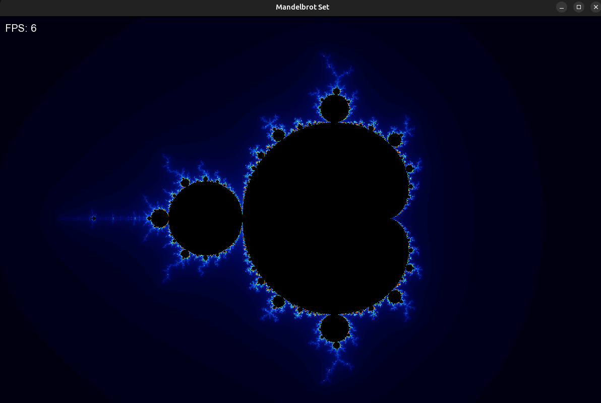
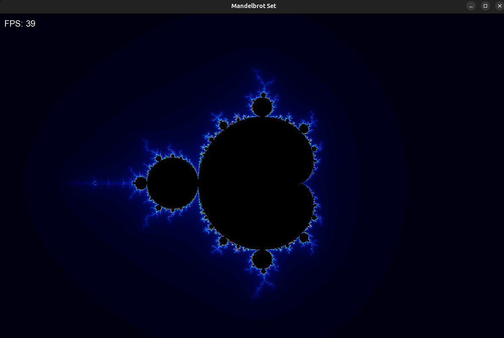
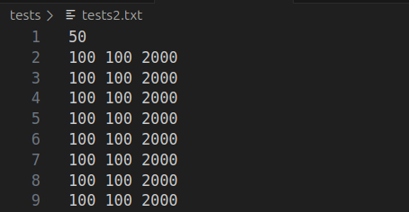
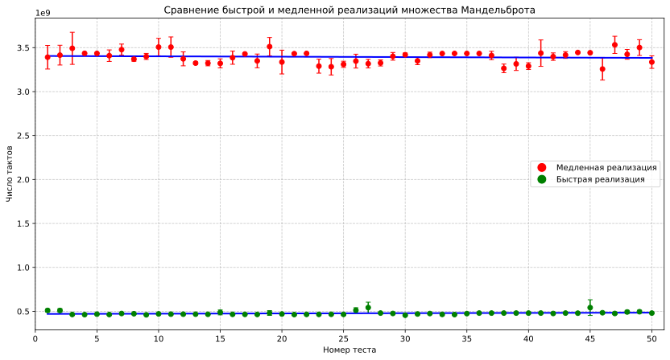
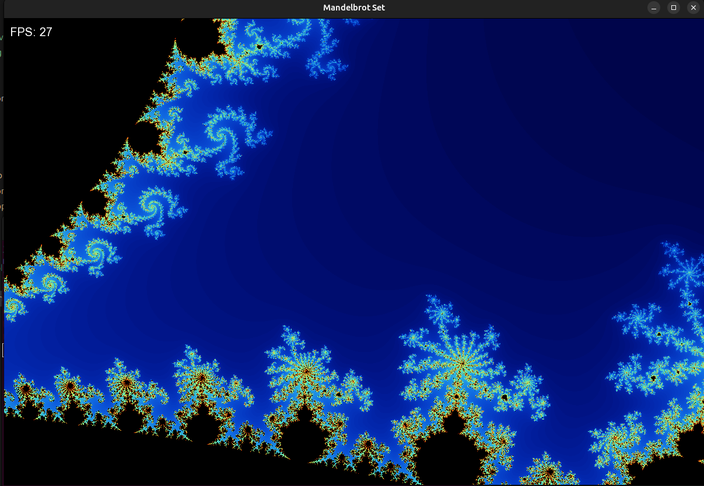

# **Множество Мандельброта**

В данной работе было предложено реализовать **множество Мандельброта** - множество точек $c$ на комплексной плоскости, для которых рекуррентное соотношение $z_{n+1} = z_n^2 + c$, $z_0 = 0$ *задаёт ограниченную последовательность*. Иначе говоря, хотим нарисовать все точки плоскости, для которых $\exist R: \forall n \in \mathbb{N} \hookrightarrow |z_n| < R$.

Множество Мандельброта является одним из самых известных *фракталов*. Вы наверняка уже где-то видели похожие картинки. О нём известно много всего интересного. Мой самый любимый факт - **длина границы множества Мандельброта бесконечна**.

## Реализация множества Мандельброта

* *Медленная версия*

В начале работы передо мной стояла ваная задача - выбрать графическую библиотеку для отрисовки самого множества на экране. Спустя множество попыток, отчаяний и грустных моментов (Ярик, ты понимаешь о чём я 😭) было принято, возможно, одно из ключевых решений в моей жизни - *поставить себе Линукс* и написать графический интерфейс при помощи библиотеки **SFML**.

Перейдём непосредственно к реализации. После изучения теории по данной теме был очевиден навный алгоритм реализации визуализации множества Мандельброта - для каждой точки по отдельности в цикле высчитывать, попадёт она в наше множество или нет. Для каждой точки проводилось по 256 итераций цикла, который высчитывал следующие значения для нашей последовательности по следующим правилам:

$$
 \begin{cases}
   x_{n+1} = x_n^2 - y_n^2 +x_0\\
   y_{n+1} = 2x_ny_n + y_0
 \end{cases}
$$

Таким образом, было необходимо делать в худшем $256 \cdot a \cdot b$ итераций (числа a и b - размеры экрана, в моём случае это 1200 и 800). Чтобы видеть, насколько быстро работает моя программа, я выводил число кадров в секунду (FPS) на экран.

Как видим, получилось добиться относительно небольшого показателя FPS - в районе от 4 до 7 кадров в секунду. При приближении данный показатель падал до 1-3.

* *Быстрая (векторизованная) версия*

Как выяснилось, мой процессор поддерживает инструкции **avx2**, которые позволяют применения необходимых инструкций сразу к вектору данных (в моём случае, вектору из 8 элементов). Это позволяет увеличить производительность за счёт обработки сразу нескольких результатов параллельно.

Обратим внимание на показатель FPS - он значительно вырос, картинка стала более плавной, и несмотря на приближение было достаточно комфортно изучать множество Мандельброта.

**Гипотеза**: так как веторизованный подход позволяет обрабатывать за раз сразу 8 значений, то *на выходе должна получиться оптимизация примерно в **8 раз***. Чтобы проверить гипотезу, необходимо провести серию тестов.

## Тестирование программы

В качестве тестов будем запускать программу с одним и тем же набором тестовых данных, чтобы затем посчитать, какой оптимизации удалось добиться на практике.

Также перед запуском тестов необходимо было вывести процессор в "стабильную фазу". Для этого перед запуском основных тестов совершался **прогрев кэшей** - запуски программы не участвующие в тестах. Все замеры времени  были в тиках процессора, считывались с помощью **rdtsc()**. Это было сделано с целью получать точные данные времени (так как *Си-шный clock()* не принимает во внимание текущую тактовую частоту процессора). Все запуски проводились с флагом оптимизации `-O3`.

Основной этап тестирования состоял из 50 тест-кейсов, каждый из которых запускался по 5 раз. Для каждого теста было посчитано *стандартное отклонение*, также в работе был изучен и применён *метод наименьших квадратов*. Результаты запусков тестов мы можете увидеть ниже (все тесты проводились на моём ноутбуке - *13th Gen Intel(R) Core(TM) i5-13500H*):

Согласно проведённым измерениям, **удалось повысить производительность** моей программы примерно в $7$ раз.

